## 🐾 About AdoptMe

AdoptMe is a web-based platform designed to connect people with animals in need of a new home.  
Users can explore available animals, submit adoption requests, and manage their own adoption activities in a simple and intuitive way.

This project focuses on building a complete adoption flow — from browsing animals to submitting requests — while maintaining a clean and user-friendly interface.

## 🛠 Tech Stack

This project is built using:

- **Laravel** — Backend framework for handling API, authentication, and business logic  
- **Filament** — Admin panel for managing data efficiently  
- **Laravel Breeze** — Lightweight authentication system (login & register)  
- **Spatie (Laravel Permission / Media Library)** — Role & permission management and file handling  
- **Tailwind CSS** — Utility-first CSS framework for modern UI design  

## 🚀 Features

### 🏠 Landing Page
The main entry point of the platform, introducing the application and guiding users to explore available animals or post a new one.

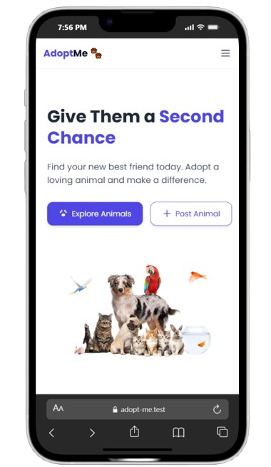

---

### 📂 Browse by Category
Users can browse animals by category such as cats, dogs, birds, and more to quickly find what they are looking for.

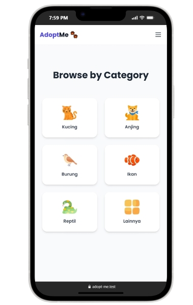

---

### 🐾 Available Animals
Displays a list of animals available for adoption, equipped with filtering, sorting, and search functionality.

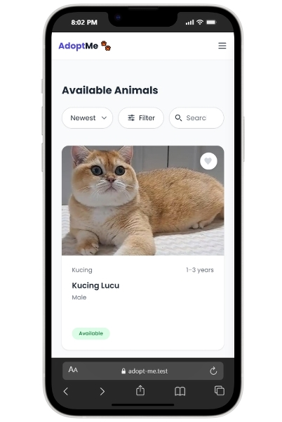

---

### 🎛 Filter System
Provides filtering options based on category, age, and gender to help users find animals more efficiently.

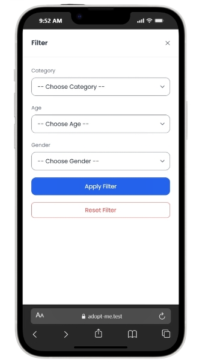

---

### 🔎 Animal Detail
Provides detailed information about each animal, including age, category, status, and the owner who posted it.

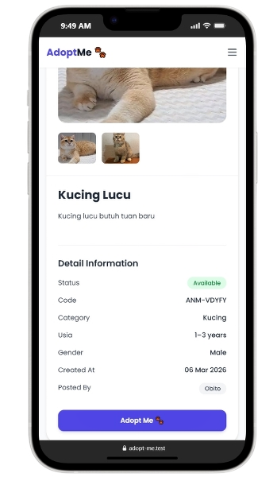

---

### 🔐 Authentication (Login & Register)
Users can create an account and log in to access features such as adoption requests and favorites.

  

    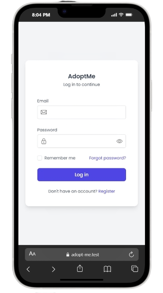
  

  

    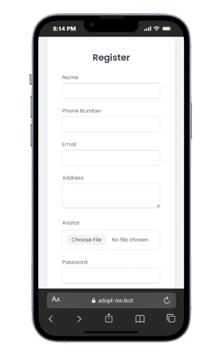
  

---

### 📝 Adoption Request
Users can submit an adoption request by filling out a structured form to ensure responsible adoption.

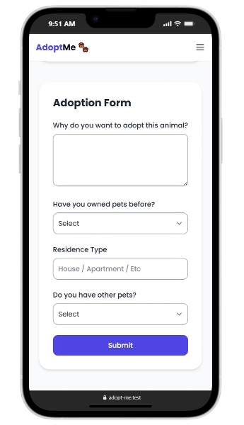

---

### 👤 User Profile
Displays user information along with adoption request statuses such as pending, approved, and rejected.

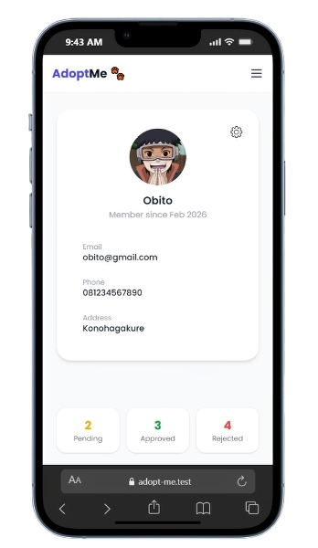

---

### ❤️ Favorites
Allows users to save animals they are interested in and access them later from their profile.

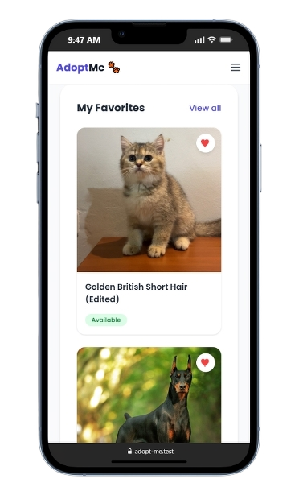

---

### 📤 Post Animal
Users can post animals for adoption by providing complete details and information.

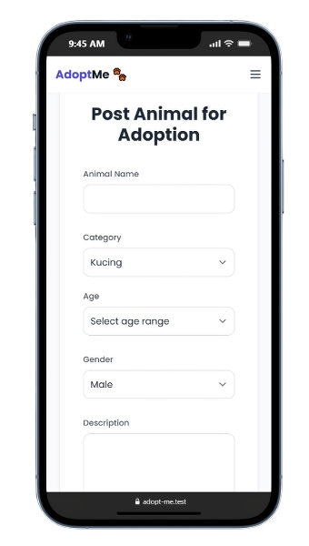

---

### 📋 My Animal Posts
Users can manage animals they have posted, including editing and deleting their listings.

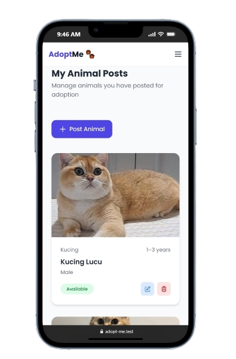

